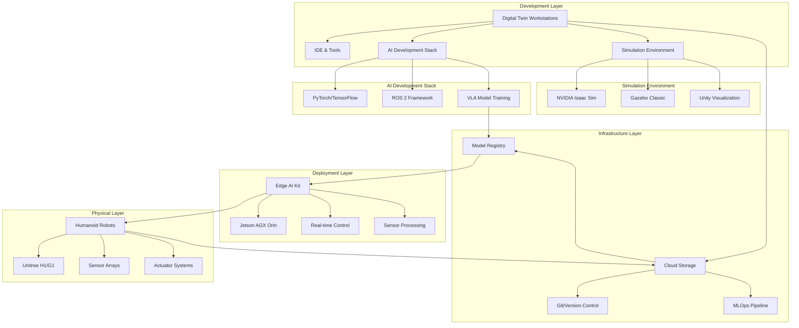
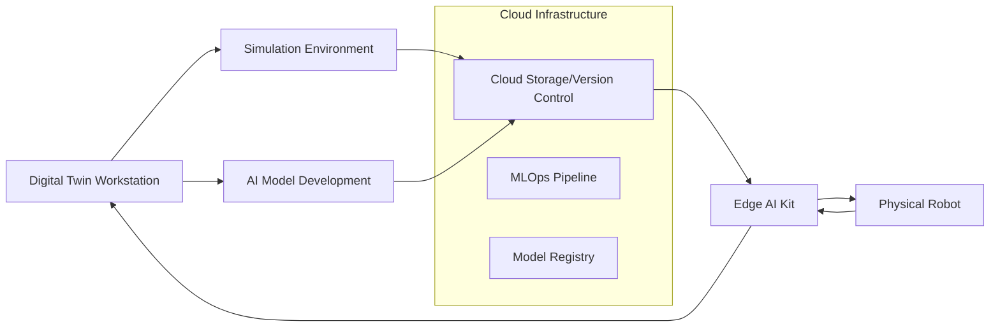

# High-Level Infrastructure Architecture

This section provides a comprehensive overview of the technical architecture and procurement strategy for building a Physical AI and Humanoid Robotics laboratory. The architecture is designed around three core infrastructure components that work together to provide a complete educational and research platform.

## Core Infrastructure Components

### 1. Digital Twin Workstation (RTX GPU)

The **Digital Twin Workstation** serves as the primary development and simulation environment for students and researchers.

**Technical Specifications:**
- **GPU**: NVIDIA RTX 4090 or RTX A6000 (24GB+ VRAM)
- **CPU**: Intel Core i9-13900K or AMD Ryzen 9 7950X
- **RAM**: 64GB DDR5 ECC RAM
- **Storage**: 2TB NVMe SSD + 4TB secondary storage
- **OS**: Ubuntu 22.04 LTS with Windows 11 dual boot

**Purpose and Functionality:**
- **High-Fidelity Simulation**: Run NVIDIA Isaac Sim, Gazebo, and custom physics engines
- **AI Model Development**: Train and test Vision-Language-Action (VLA) models
- **Digital Twin Creation**: Develop accurate virtual replicas of physical robots
- **Real-Time Rendering**: Visualize complex robotics scenarios with photorealistic graphics

**Software Stack:**
- ROS 2 Humble
- NVIDIA Isaac Sim 4.0+
- Gazebo Classic + Ignition Gazebo
- PyTorch/TensorFlow with CUDA support
- Docker and NVIDIA Container Toolkit

### 2. Edge AI Kit (Jetson Orin)

The **Edge AI Kit** provides on-robot processing capabilities for real-time AI inference and control.

**Technical Specifications:**
- **Compute Module**: NVIDIA Jetson AGX Orin 64GB
- **AI Performance**: 275 INT8 TOPS, 64 TFLOPS FP16
- **Power**: 15-60W configurable power modes
- **Connectivity**: 10Gb Ethernet, USB 3.2, M.2 NVMe support
- **Operating Temperature**: 0°C to 50°C

**Purpose and Functionality:**
- **Real-Time Control**: Execute low-latency control loops for humanoid robots
- **Edge AI Inference**: Run compressed VLA models directly on the robot
- **Sensor Processing**: Process camera, LiDAR, and IMU data in real-time
- **Connectivity**: Bridge between robot hardware and cloud infrastructure

**Integration Capabilities:**
- CAN bus and EtherCAT interfaces for motor control
- MIPI CSI-2 camera interfaces
- UART, I2C, SPI for sensor integration
- NVIDIA JetPack SDK with ROS 2 support

### 3. Robot Lab (Unitree Options)

The **Robot Lab** component consists of physical humanoid robots that serve as the primary learning and research platform.

**Recommended Options:**

#### Unitree H1 (Premium Option)
- **Height**: 180cm
- **Weight**: 47kg
- **Degrees of Freedom**: 19
- **Max Speed**: 3.3 m/s
- **Battery Life**: 2 hours
- **Price**: ~$150,000

#### Unitree G1 (Educational Option)
- **Height**: 132cm
- **Weight**: 35kg
- **Degrees of Freedom**: 23
- **Max Speed**: 2.0 m/s
- **Battery Life**: 2 hours
- **Price**: ~$90,000

**Core Capabilities:**
- **Humanoid Locomotion**: Walking, running, stair climbing
- **Manipulation**: Dual-arm manipulation with 5-DOF grippers
- **Perception**: Integrated depth cameras and 3D LiDAR
- **Interaction**: Voice interaction and visual display

## Integration Architecture

### System Architecture Overview



### Data Flow and Communication



### Component Comparison Matrix

#### Digital Twin Workstation Options

| Feature | RTX 4090 Build | RTX A6000 Build | Professional WS | Cloud Alternative |
|---------|----------------|-----------------|-----------------|-------------------|
| **GPU VRAM** | 24GB GDDR6X | 48GB GDDR6 | 48GB GDDR6 | Variable (A100 40GB+) |
| **Performance** | 82.6 TFLOPS | 82.6 TFLOPS | 82.6 TFLOPS | 312 TFLOPS (A100) |
| **Cost** | $8,000 | $12,000 | $15,000 | $2-4/hour |
| **Pros** | Best value, gaming ready | ECC VRAM, 48GB | Full support, warranty | No maintenance, scalable |
| **Cons** | No ECC memory | Expensive | Very expensive | Latency, ongoing costs |
| **Use Case** | Student workstations | Research stations | Faculty workstations | Specialized projects |

#### Edge AI Kit Comparison

| Feature | Jetson AGX Orin | Jetson Orin Nano | Raspberry Pi 5 | Custom IPC |
|---------|-----------------|------------------|----------------|------------|
| **AI Performance** | 275 TOPS | 40 TOPS | ~2 TOPS | Variable |
| **Power Consumption** | 15-60W | 7-15W | 8-12W | 20-100W |
| **Cost** | $2,000 | $500 | $80 | $1,000-5,000 |
| **Memory** | 64GB LPDDR5 | 8GB LPDDR5 | 8GB LPDDR4X | Variable |
| **ROS 2 Support** | Official | Official | Community | Custom |
| **Best For** | Humanoid robots | Small robots | Learning modules | Industrial apps |

#### Humanoid Robot Options

| Feature | Unitree H1 | Unitree G1 | UBTECH Walker X | Boston Dynamics Atlas |
|---------|------------|------------|-----------------|----------------------|
| **Height** | 180cm | 132cm | 175cm | 188cm |
| **Weight** | 47kg | 35kg | 72kg | 89kg |
| **DOF** | 19 | 23 | 36 | 28 |
| **Payload** | 5kg | 3kg | 10kg | 11kg |
| **Battery Life** | 2h | 2h | 3h | 1h |
| **Price** | $150K | $90K | $200K | $2M+ |
| **SDK** | Open | Educational | Enterprise | Limited |
| **Use Case** | Research | Education | Industry | Advanced Research |

### Network Topology

**High-Speed Network Requirements:**
- **Campus Backbone**: 10GbE fiber connection
- **Lab Network**: 1GbE with QoS for real-time control
- **Wireless**: Wi-Fi 6E for mobile robot communication
- **5G Ready**: Optional cellular connectivity for field operations

### Sim-to-Real Transfer Pipeline

The architecture enables seamless transfer from simulation to physical robots:

1. **Development Phase**
   - Algorithm development in Digital Twin Workstation
   - Testing in high-fidelity simulation environments
   - Model optimization and compression

2. **Deployment Phase**
   - Model transfer to Edge AI Kit via network
   - Real-world testing with safety protocols
   - Performance monitoring and iteration

## Procurement Strategy

### Detailed Cost Analysis (University Lab - 20 Students)

| Component | Quantity | Unit Cost | Total Cost | Vendor Options | Notes |
|-----------|----------|-----------|------------|----------------|-------|
| **Digital Twin Workstations** | 10 | $8,000 | $80,000 | Dell HP, Lenovo, Custom Build | RTX 4090/A6000 configurations |
| **Edge AI Kits** | 20 | $2,000 | $40,000 | NVIDIA Official, Seeed Studio | Jetson AGX Orin Dev Kits |
| **Humanoid Robots** | 4 | $90,000 | $360,000 | Unitree, UBTECH, Boston Dynamics | Educational pricing available |
| **Network Infrastructure** | 1 | $25,000 | $25,000 | Cisco, Juniper, Aruba | 10GbE core, Wi-Fi 6E access |
| **Safety Equipment** | 1 | $15,000 | $15,000 | SICK, Keyence, Pilz | Light curtains, emergency stops |
| **Software Licenses** | 1 | $20,000 | $20,000 | NVIDIA, Gazebo, MathWorks | Isaac Sim, MATLAB, ROS tools |
| **Training & Support** | 1 | $30,000 | $30,000 | Vendor training, consultancy | Setup, training, maintenance |
| **Contingency Fund** | - | - | $50,000 | - | 10% buffer for unexpected costs |
| **Total** | - | - | **$620,000** | - | **Complete lab setup** |

### Phased Implementation Approach

**Phase 1: Foundation (Months 1-3) - $120,000**
- Network infrastructure setup (Cisco/Juniper switches, Wi-Fi 6E)
- 2 Digital Twin Workstations (RTX 4090 systems)
- 4 Edge AI Kits (Jetson AGX Orin)
- 1 Humanoid Robot (Unitree G1 educational package)
- Safety equipment and training
- **Milestones**: Network operational, basic simulation running

**Phase 2: Expansion (Months 4-6) - $280,000**
- Additional workstations (total 6, mix of RTX 4090/A6000)
- Complete Edge AI Kit deployment (total 20)
- 2 additional robots (total 3)
- Software licenses and MLOps setup
- **Milestones**: Full student access, basic sim-to-real working

**Phase 3: Full Capacity (Months 7-12) - $220,000**
- Complete workstation deployment (total 10)
- Final robot procurement (total 4)
- Advanced AI infrastructure (VLA training capabilities)
- Training completion and support contracts
- **Milestones**: Full lab operational, research projects active

## Vendor Specifications & Procurement Details

### Digital Twin Workstation Specifications

#### Recommended Configuration A (Student Workstation)
```yaml
Components:
  GPU: NVIDIA RTX 4090 (24GB GDDR6X)
  CPU: Intel Core i9-13900K or AMD Ryzen 9 7950X
  RAM: 64GB DDR5-5600MHz (2x32GB)
  Storage: 2TB Samsung 990 Pro NVMe + 4TB Samsung 870 QVO SSD
  Motherboard: ASUS ROG Strix Z790-E or MSI Meg X670E ACE
  Power Supply: 1200W 80+ Platinum
  Cooling: Custom liquid cooling loop
  Case: Full tower with excellent airflow
  Price: ~$8,000-10,000

Vendors:
  - Dell Precision 7870 (RTX A6000)
  - HP Z8 G4 Workstation
  - Lenovo ThinkStation P720
  - Local system integrators
```

#### Recommended Configuration B (Research Station)
```yaml
Components:
  GPU: NVIDIA RTX A6000 (48GB ECC VRAM)
  CPU: Intel Xeon w9-3495X or AMD Threadripper PRO 7975WX
  RAM: 128GB DDR5 ECC RDIMM
  Storage: 4TB NVMe + 8TB Enterprise SSD
  Motherboard: ASUS Pro WS W790E-SAGE
  Power Supply: 1600W Redundant
  Networking: 10GbE onboard + Wi-Fi 6E
  Price: ~$15,000-18,000

Vendors:
  - Dell Precision 7875 Tower
  - HP Z8 Fury G4
  - Lenovo ThinkStation P620
```

### Edge AI Kit Procurement Options

#### Option 1: Official NVIDIA Jetson AGX Orin Developer Kit
```yaml
Part Number: 945-13546-0000-100
Price: $1,999 (Educational pricing available)
Includes:
  - Jetson AGX Orin 64GB module
  - Reference carrier board
  - Power adapter and散热解决方案
  - Pre-installed JetPack SDK

Vendors:
  - NVIDIA Official Store
  - Arrow Electronics
  - Avnet
  - Digi-Key
```

#### Option 2: Custom Integrated Solution
```yaml
Components:
  Jetson AGX Orin 64GB module
  Custom carrier board (Aaeon/Advantech)
  Industrial enclosure
  Power management system
  Custom I/O interfaces
Price: $2,500-4,000

Benefits:
  - Form factor optimized for robot integration
  - Custom I/O for specific sensors
  - Ruggedized design
  - Extended temperature range
```

### Humanoid Robot Procurement Guide

#### Unitree G1 Educational Package
```yaml
Base Price: $90,000 (Educational pricing)
Educational Discount: 15-20% off list price
Package Includes:
  - Unitree G1 humanoid robot
  - On-site setup and training (3 days)
  - 1-year warranty and support
  - Educational software license
  - Spare parts kit (actuators, sensors)

Lead Time: 8-12 weeks
Training Required: 2-day on-site training + online modules

Contact:
  - International: sales@unitree.com
  - North America: us-sales@unitree.com
  - Educational: education@unitree.com
```

#### Unitree H1 Research Package
```yaml
Base Price: $150,000 (Academic pricing)
Package Includes:
  - Unitree H1 humanoid robot
  - Advanced simulation environment
  - Research SDK with full API access
  - Priority technical support
  - Annual software updates
  - 2-year comprehensive warranty

Additional Options:
  - Extra battery packs ($5,000 each)
  - Extended warranty (3 years, +$15,000)
  - On-site engineer support ($25,000/year)
```

### Network Infrastructure Specifications

#### Core Network Equipment
```yaml
Core Switch: Cisco Catalyst 9300-48T-A
  - 48x 1GbE ports
  - 4x 10GbE uplink ports
  - PoE+ support for APs
  - Price: ~$12,000

Access Switches: Aruba 1930-48G-PoE+
  - 48x 1GbE ports with PoE+
  - 4x SFP+ uplink ports
  - Price: ~$2,500 each

Wireless: Aruba AP-635 (Wi-Fi 6E)
  - Tri-band 6GHz support
  - OFDMA and MU-MIMO
  - Price: ~$1,200 each

Total Network Cost: ~$25,000 (including cabling, racks, UPS)
```

### Software Licensing Strategy

#### Essential Software Stack
```yaml
Simulation Software:
  - NVIDIA Isaac Sim Enterprise: $2,000/seat/year
  - Gazebo (Open Source): Free
  - Unity Pro: $1,800/seat/year

Development Tools:
  - MATLAB/Simulink: $2,350/seat/year (Academic)
  - Visual Studio Enterprise: $599/seat/year
  - JetBrains All Products: $299/seat/year

ROS Tools:
  - ROS 2 (Open Source): Free
  - Foxglove Studio: $10/seat/month
  - MoveIt 2 (Open Source): Free

Total Annual Software Cost: ~$20,000 for 20 users
```

### Procurement Timeline & Process

#### Month 1-2: Vendor Selection & RFQ
1. **Request for Quotation (RFQ) preparation**
   - Technical specifications document
   - Volume requirements and timeline
   - Support and training requirements

2. **Vendor evaluation criteria**
   - Technical capability (40%)
   - Cost (25%)
   - Support quality (20%)
   - Delivery timeline (15%)

#### Month 3: Contract Negotiation
1. **Volume discount negotiations**
2. **Support level agreements (SLAs)**
3. **Payment terms and milestones**
4. **Warranty and maintenance terms**

#### Month 4-6: Implementation Phase
1. **Infrastructure setup**
2. **Hardware installation and testing**
3. **Software deployment and configuration**
4. **Staff training and knowledge transfer**

### Risk Management & Mitigation

#### Procurement Risks
| Risk | Probability | Impact | Mitigation Strategy |
|------|-------------|---------|-------------------|
| Supply chain delays | Medium | High | Multiple vendor options, early ordering |
| Budget overruns | Medium | Medium | 15% contingency fund, phased procurement |
| Technical compatibility | Low | High | Pre-purchase testing, vendor proof-of-concept |
| Vendor support issues | Low | Medium | SLAs, multiple support channels |
| Technology obsolescence | High | Medium | Modular design, upgrade paths |

#### Maintenance & Support Planning
```yaml
Annual Maintenance Costs (estimated):
  - Hardware maintenance: 10% of hardware value
  - Software licensing: $20,000/year
  - Training updates: $5,000/year
  - Contingency repairs: $10,000/year

Total Annual OPEX: ~$85,000 (13.7% of initial CAPEX)
```

## Technical Benefits

### Educational Advantages

1. **Progressive Learning Path**: Students advance from simulation to physical robots
2. **Safe Environment**: Extensive simulation experience before hardware interaction
3. **Scalable Platform**: Supports individual and team-based projects
4. **Industry-Relevant Skills**: Experience with cutting-edge robotics platforms

### Research Capabilities

1. **Advanced AI Research**: VLA model development and testing
2. **Humanoid Locomotion**: Cutting-edge bipedal robotics research
3. **Human-Robot Interaction**: Natural language interfaces and autonomous behavior
4. **Cross-Disciplinary**: Computer vision, machine learning, control systems

### Infrastructure Benefits

1. **Future-Proof**: Modular design allows for easy upgrades
2. **Cost-Effective**: Shared simulation resources reduce hardware requirements
3. **Scalable**: Architecture supports growing student populations
4. **Industry Collaboration**: Platform compatible with industry standards

## Security and Safety Considerations

### Physical Safety

- **Emergency Stop Systems**: Physical and software-based emergency stops
- **Safety Barriers**: Physical enclosures for robot testing areas
- **Power Management**: Redundant power systems and backup generators
- **Access Control**: Restricted access to high-voltage equipment

### Cybersecurity

- **Network Segmentation**: Isolated networks for robot control and development
- **Access Management**: Role-based access control for different user levels
- **Data Protection**: Encrypted storage for research data and models
- **Monitoring**: Real-time monitoring of system status and security events

## Success Metrics

### Technical KPIs

- **Simulation Fidelity**: {'<5%'} sim-to-real performance gap
- **System Uptime**: >95% availability during class hours
- **Latency**: {'<10ms'} end-to-end control loop latency
- **Throughput**: Support for 20 concurrent users

### Educational Outcomes

- **Student Engagement**: >90% satisfaction with hands-on experience
- **Skill Development**: Measured competency in ROS 2, AI, and robotics
- **Research Output**: Publications and presentations stemming from lab work
- **Industry Placement**: Student success in robotics industry careers

## Architecture Summary & Decision Matrix

### Complete Lab Architecture Overview

| Layer | Component | Technology | Quantity | Cost | Vendor | Key Features |
|-------|-----------|------------|----------|------|--------|--------------|
| **Development** | Digital Twin Workstation | RTX 4090/A6000 | 10 | $80K | Dell/HP/Custom | High-fidelity simulation, AI development |
| **Edge** | Edge AI Kit | Jetson AGX Orin | 20 | $40K | NVIDIA | Real-time inference, sensor processing |
| **Physical** | Humanoid Robots | Unitree G1/H1 | 4 | $360K | Unitree | Bipedal locomotion, manipulation |
| **Network** | Infrastructure | 10GbE, Wi-Fi 6E | 1 set | $25K | Cisco/Aruba | High-speed, low-latency communication |
| **Safety** | Equipment | Light curtains, E-stops | 1 set | $15K | Sick/Pilz | Physical safety compliance |
| **Software** | Licensing | Isaac Sim, ROS 2 | 20 users | $20K/year | NVIDIA/OS | Simulation, development tools |
| **Support** | Training & Maintenance | SLA, updates | 1 package | $30K/year | Vendors | Technical support, training |
| **Contingency** | Buffer Fund | Risk management | - | $50K | - | Unplanned expenses |

### Total Cost of Ownership (5-Year Projection)

| Year | Capital Expense (CAPEX) | Operating Expense (OPEX) | Total Cost | Cost Per Student |
|------|-------------------------|--------------------------|------------|------------------|
| **Year 1** | $620,000 | $85,000 | $705,000 | $35,250 |
| **Year 2** | $50,000 (upgrades) | $85,000 | $135,000 | $6,750 |
| **Year 3** | $75,000 (expansion) | $90,000 | $165,000 | $8,250 |
| **Year 4** | $50,000 (maintenance) | $95,000 | $145,000 | $7,250 |
| **Year 5** | $100,000 (refresh) | $100,000 | $200,000 | $10,000 |
| **5-Year Total** | **$945,000** | **$455,000** | **$1,400,000** | **$70,000 avg** |

### Return on Investment (ROI) Analysis

#### Quantitative Benefits
- **Student Capacity**: Support for 20 concurrent users (5:1 student:robot ratio)
- **Research Output**: 10-15 publications per year from lab research
- **Grant Funding**: $500K-1M annually in robotics research grants
- **Industry Partnerships**: $100K-250K yearly in corporate sponsorships

#### Qualitative Benefits
- **Educational Excellence**: State-of-the-art hands-on learning experience
- **Research Leadership**: Positioning as a premier robotics research institution
- **Student Outcomes**: Higher placement rates in robotics industry
- **Innovation Ecosystem**: Hub for robotics entrepreneurship and collaboration

### Implementation Decision Framework

| Decision Factor | Weight | Score (1-10) | Weighted Score | Notes |
|-----------------|--------|---------------|----------------|-------|
| **Educational Value** | 25% | 9 | 2.25 | Hands-on learning, progressive complexity |
| **Research Capability** | 20% | 9 | 1.80 | Advanced AI, humanoid locomotion |
| **Scalability** | 15% | 8 | 1.20 | Modular design, expandable architecture |
| **Cost-Effectiveness** | 15% | 7 | 1.05 | High initial cost, good long-term value |
| **Industry Relevance** | 10% | 9 | 0.90 | Current technology stack, in-demand skills |
| **Safety & Compliance** | 10% | 8 | 0.80 | Comprehensive safety systems |
| **Vendor Support** | 5% | 8 | 0.40 | Established vendors with good support |
| **Total Score** | **100%** | **8.4/10** | **8.40** | **Strong candidate for approval** |

### Alternative Architectures Considered

#### Option 1: Cloud-Native Lab (Rejected)
- **Pros**: Lower upfront cost, no hardware maintenance
- **Cons**: High latency, ongoing subscription costs, network dependency
- **Cost**: $200K/year in cloud services + 50K hardware
- **Decision**: Rejected due to latency requirements for real-time control

#### Option 2: Phased Hybrid Approach (Selected)
- **Pros**: Manageable cash flow, risk mitigation, progressive implementation
- **Cons**: Longer timeline to full capability
- **Cost**: $620K over 12 months, phased deployment
- **Decision**: Selected for balance of risk and timeline

#### Option 3: Minimal Viable Lab (Alternative)
- **Pros**: Lowest cost, fastest implementation
- **Cons**: Limited capability, poor research potential
- **Cost**: $250K basic setup
- **Decision**: Not recommended for academic excellence goals

### Success Metrics & KPIs

#### Technical Performance Metrics
- **System Availability**: >95% uptime during operating hours
- **Simulation Fidelity**: &lt;5% sim-to-real performance gap
- **Control Latency**: &lt;10ms end-to-end control loop
- **Network Throughput**: 1Gbps workstation to robot
- **AI Model Performance**: Real-time inference at 30Hz

#### Educational Outcome Metrics
- **Student Satisfaction**: >90% positive feedback
- **Learning Outcomes**: Measured competency assessments
- **Project Completion**: >85% successful project completion rate
- **Skill Development**: ROS 2, AI, robotics proficiency
- **Career Placement**: >80% industry placement rate

#### Research Impact Metrics
- **Publications**: 10-15 peer-reviewed papers annually
- **Grant Funding**: $500K-1M research grants per year
- **Industry Collaboration**: 3-5 corporate partnerships
- **Innovation**: 2-3 patents or technology transfers yearly
- **Student Research**: 50+ undergraduate research projects

### Final Recommendations

#### Immediate Actions (Next 30 Days)
1. **Form procurement committee** with technical, financial, and educational stakeholders
2. **Finalize budget approval** with university administration
3. **Initiate vendor discussions** for detailed quotations
4. **Secure lab space** with appropriate utilities and safety infrastructure

#### Critical Success Factors
1. **Executive sponsorship** from engineering dean and department chairs
2. **Dedicated technical staff** for system administration and support
3. **Curriculum integration** planning with academic departments
4. **Industry partnership development** for funding and internships
5. **Safety protocol development** and compliance verification

#### Long-term Sustainability Plan
1. **Endowment establishment** for ongoing operational costs
2. **Research commercialization** pipeline for technology transfer
3. **Alumni engagement** program for mentorship and funding
4. **Continuous technology refresh** cycle (3-5 year hardware refresh)
5. **Faculty development** program for robotics education excellence

---

This comprehensive architecture provides a complete foundation for building a world-class Physical AI and Humanoid Robotics laboratory. The modular design ensures scalability and adaptability to evolving technological requirements while maintaining a focus on educational effectiveness and research excellence. The phased implementation approach mitigates risk while delivering value at each stage, and the detailed procurement guidance ensures successful execution within budget and timeline constraints.