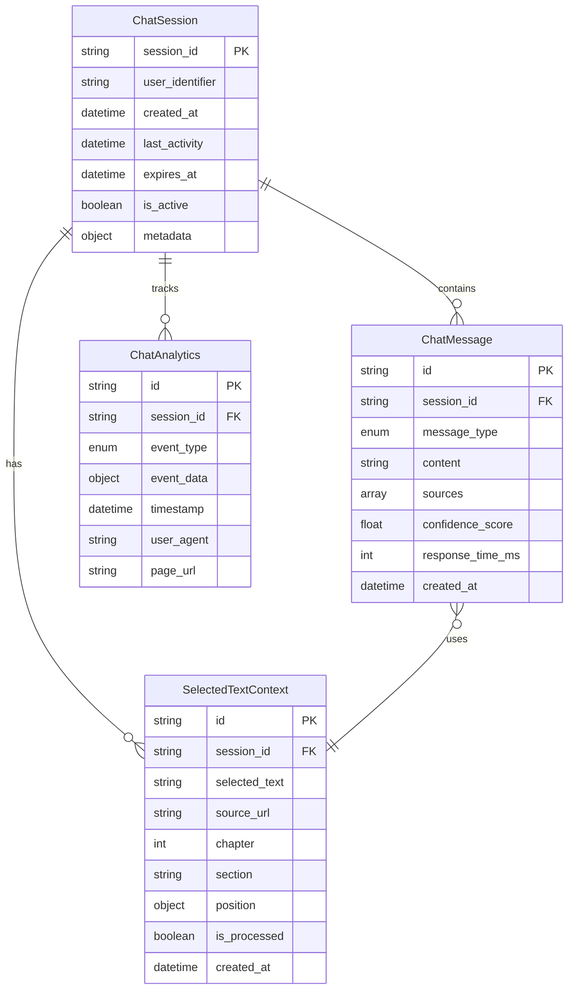

# Data Model: Docusaurus RAG Chatbot Widget

## Entity Overview

The chatbot system manages conversations, sessions, user interactions, and content context. The data model supports persistent chat history, text selection context, and real-time communication between the frontend widget and backend services.

## Core Entities

### 1. User Session

Represents a user's interaction session with the chatbot, managing conversation state and persistence.

**Fields**:
- `session_id`: String (UUID) - Unique identifier for the session
- `user_identifier`: String (Optional) - Optional user ID for tracking
- `created_at`: DateTime - Session creation timestamp
- `last_activity`: DateTime - Last interaction timestamp
- `expires_at`: DateTime (Optional) - Session expiration time
- `is_active`: Boolean - Whether the session is currently active
- `metadata`: Object (Optional) - Additional session data

**State Transitions**:
- `created` → `active` → `expired` → `archived`
- Sessions automatically expire after 30 days of inactivity
- Sessions can be manually closed by users

**Relationships**:
- One-to-many with `ChatMessage`
- One-to-many with `TextSelectionEvent`

### 2. Chat Message

Individual messages in a conversation, including user questions and AI responses.

**Fields**:
- `id`: String (UUID) - Unique message identifier
- `session_id`: String (UUID) - Reference to parent session
- `message_type`: Enum (`question`, `answer`, `system`) - Type of message
- `content`: String - Message content
- `sources`: Array (Optional) - Source citations for AI responses
- `confidence_score`: Float (Optional, 0.0-1.0) - AI confidence in response
- `response_time_ms`: Integer (Optional) - Time to generate response
- `selected_text_context`: String (Optional) - Selected text used as context
- `created_at`: DateTime - Message timestamp

**Validation Rules**:
- `content` required and non-empty
- `message_type` must be valid enum value
- `confidence_score` between 0.0 and 1.0 if provided
- `response_time_ms` must be positive if provided

**Relationships**:
- Many-to-one with `ChatSession`
- Optional one-to-one with `SelectedTextContext`

### 3. Selected Text Context

Context information when users highlight specific text for targeted questions.

**Fields**:
- `id`: String (UUID) - Unique context identifier
- `session_id`: String (UUID) - Associated session
- `selected_text`: String - The actual text selected by user
- `source_url`: String - Page URL where text was selected
- `chapter`: Integer (Optional) - Chapter number if available
- `section`: String (Optional) - Section title
- `position`: Object - Text position coordinates
  - `start_offset`: Integer - Character start position
  - `end_offset`: Integer - Character end position
  - `page_x`: Float - X coordinate on page
  - `page_y`: Float - Y coordinate on page
- `is_processed`: Boolean - Whether context has been used in chat
- `created_at`: DateTime - Context creation timestamp

**Validation Rules**:
- `selected_text` required and max 2000 characters
- `source_url` must be valid URL
- Position coordinates must be positive numbers
- Start offset must be less than end offset

**Relationships**:
- Many-to-one with `ChatSession`
- One-to-many with `ChatMessage` (when used as context)

### 4. Chat Analytics

Usage analytics for monitoring chatbot performance and user engagement.

**Fields**:
- `id`: String (UUID) - Unique analytics entry
- `session_id`: String (UUID) - Associated session
- `event_type`: Enum (`message_sent`, `response_received`, `text_selected`, `widget_opened`)
- `event_data`: Object (Optional) - Additional event-specific data
- `timestamp`: DateTime - Event timestamp
- `user_agent`: String (Optional) - Browser information
- `page_url`: String (Optional) - Current page URL

## Data Relationships



## Database Schema

### Tables

#### chat_sessions
```sql
CREATE TABLE chat_sessions (
    session_id VARCHAR(36) PRIMARY KEY,
    user_identifier VARCHAR(255),
    created_at TIMESTAMP DEFAULT CURRENT_TIMESTAMP,
    last_activity TIMESTAMP DEFAULT CURRENT_TIMESTAMP ON UPDATE CURRENT_TIMESTAMP,
    expires_at TIMESTAMP NULL,
    is_active BOOLEAN DEFAULT TRUE,
    metadata JSON,
    INDEX idx_sessions_user (user_identifier),
    INDEX idx_sessions_activity (last_activity),
    INDEX idx_sessions_active (is_active, expires_at)
);
```

#### chat_messages
```sql
CREATE TABLE chat_messages (
    id VARCHAR(36) PRIMARY KEY,
    session_id VARCHAR(36) NOT NULL,
    message_type ENUM('question', 'answer', 'system') NOT NULL,
    content TEXT NOT NULL,
    sources JSON,
    confidence_score DECIMAL(3,2),
    response_time_ms INTEGER,
    selected_text_context TEXT,
    created_at TIMESTAMP DEFAULT CURRENT_TIMESTAMP,
    FOREIGN KEY (session_id) REFERENCES chat_sessions(session_id) ON DELETE CASCADE,
    INDEX idx_messages_session (session_id),
    INDEX idx_messages_type (message_type),
    INDEX idx_messages_created (created_at)
);
```

#### selected_text_contexts
```sql
CREATE TABLE selected_text_contexts (
    id VARCHAR(36) PRIMARY KEY,
    session_id VARCHAR(36) NOT NULL,
    selected_text TEXT NOT NULL,
    source_url VARCHAR(2048) NOT NULL,
    chapter INTEGER,
    section VARCHAR(255),
    position_start_offset INTEGER NOT NULL,
    position_end_offset INTEGER NOT NULL,
    position_page_x DECIMAL(10,2),
    position_page_y DECIMAL(10,2),
    is_processed BOOLEAN DEFAULT FALSE,
    created_at TIMESTAMP DEFAULT CURRENT_TIMESTAMP,
    FOREIGN KEY (session_id) REFERENCES chat_sessions(session_id) ON DELETE CASCADE,
    INDEX idx_contexts_session (session_id),
    INDEX idx_contexts_processed (is_processed),
    INDEX idx_contexts_created (created_at)
);
```

#### chat_analytics
```sql
CREATE TABLE chat_analytics (
    id VARCHAR(36) PRIMARY KEY,
    session_id VARCHAR(36) NOT NULL,
    event_type ENUM('message_sent', 'response_received', 'text_selected', 'widget_opened') NOT NULL,
    event_data JSON,
    timestamp TIMESTAMP DEFAULT CURRENT_TIMESTAMP,
    user_agent TEXT,
    page_url VARCHAR(2048),
    FOREIGN KEY (session_id) REFERENCES chat_sessions(session_id) ON DELETE CASCADE,
    INDEX idx_analytics_session (session_id),
    INDEX idx_analytics_type (event_type),
    INDEX idx_analytics_timestamp (timestamp)
);
```

## API Data Transfer Objects

### Chat Request
```json
{
  "message": "string (required, max 1000 chars)",
  "session_id": "string (required)",
  "selected_text": "string (optional, max 2000 chars)",
  "context": {
    "page_url": "string (optional)",
    "chapter": "integer (optional)",
    "section": "string (optional)"
  }
}
```

### Chat Response
```json
{
  "answer": "string (required)",
  "sources": [
    {
      "url": "string (required)",
      "title": "string (required)",
      "snippet": "string (required)",
      "relevance_score": "number (optional, 0.0-1.0)",
      "chapter": "integer (optional)",
      "section": "string (optional)"
    }
  ],
  "session_id": "string (required)",
  "message_id": "string (required)",
  "response_time_ms": "integer (optional)",
  "confidence_score": "number (optional, 0.0-1.0)",
  "followup_suggestions": ["string"],
  "selected_text_used": "boolean"
}
```

### Session Creation Request
```json
{
  "user_identifier": "string (optional)",
  "language_preference": "string (default: 'en')",
  "context": {
    "entry_page": "string (optional)",
    "referrer": "string (optional)"
  }
}
```

## Data Lifecycle

### Creation
1. New session created when user first interacts with chat widget
2. Chat messages created for each user question and AI response
3. Text selection context created when user highlights text
4. Analytics events created for all significant user interactions

### Updates
1. Session `last_activity` updated on any interaction
2. Text selection context marked as `is_processed` when used
3. Session `expires_at` set when user closes browser or after timeout

### Deletion
1. Automatic cleanup of sessions and related data after 30 days
2. Manual deletion available for privacy compliance
3. Analytics data retained separately for longer periods for analysis

### Privacy Considerations
- Selected text contexts stored temporarily and cleaned up after use
- User identifiers optional for anonymous usage
- All data encrypted at rest and in transit
- Automatic cleanup ensures no long-term storage of sensitive data

## Performance Considerations

### Indexing Strategy
- Primary keys on all tables for fast lookups
- Composite indexes on frequently queried column combinations
- Time-based indexes for cleanup operations

### Query Optimization
- Session-based queries use indexed session_id
- Time-based queries use created_at indexes
- Analytics queries optimized for aggregation

### Data Archival
- Old sessions moved to archive tables after 30 days
- Hot tables maintain recent data for optimal performance
- Archive data available for long-term analysis