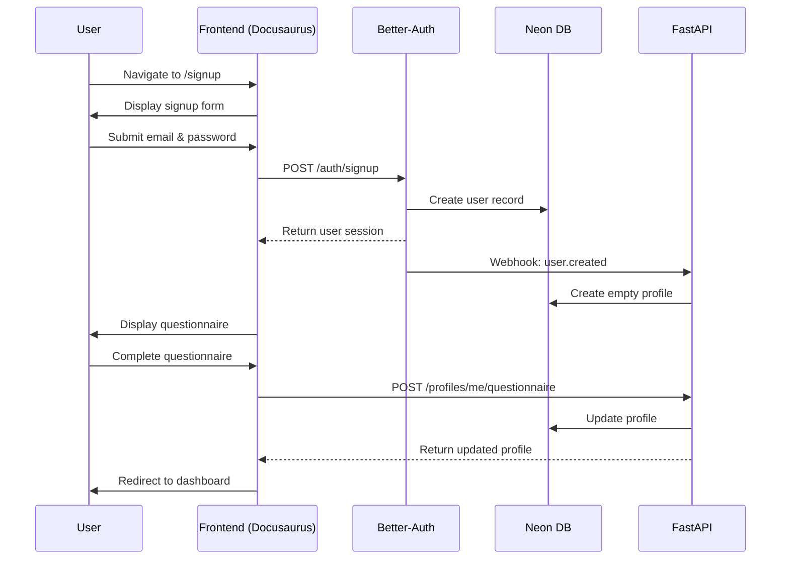
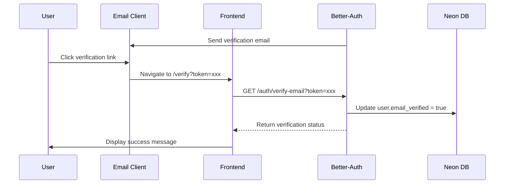
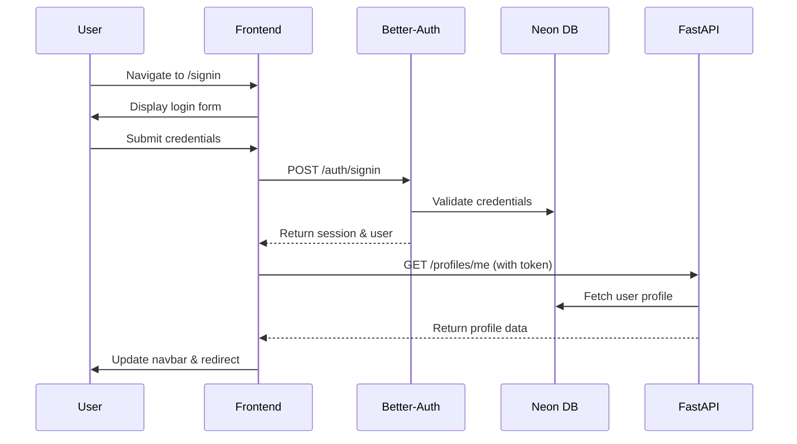
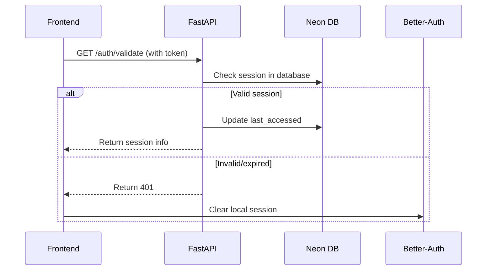
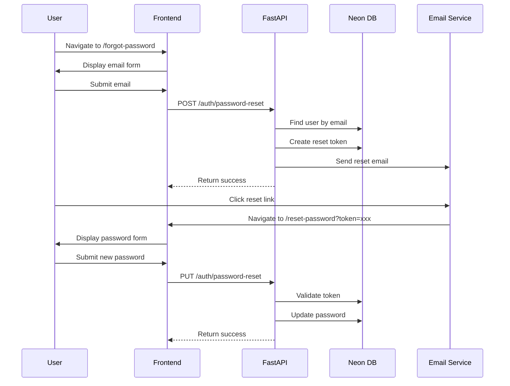
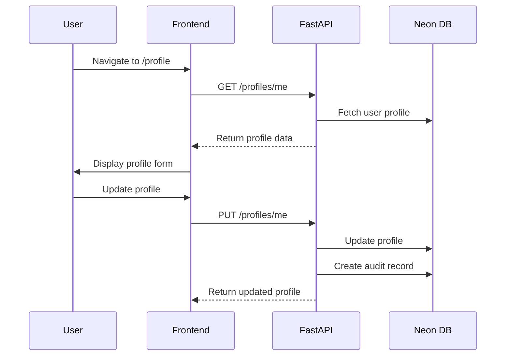
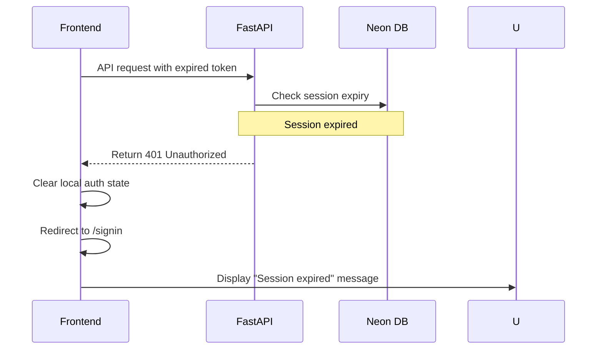

# Authentication Flow Documentation

## Overview

This document describes the complete authentication flows for the personalized auth system, including user registration, login, session management, and profile management.

## Flow 1: User Registration



### Detailed Steps

1. **Initial Signup**
   - User navigates to `/signup`
   - Frontend renders multi-step form with validation
   - Email format and password strength validated client-side
   - Form submitted to Better-Auth signup endpoint

2. **Account Creation**
   - Better-Auth creates user record in Neon DB
   - Generates session token
   - Sends verification email
   - Returns session to frontend

3. **Profile Initialization**
   - Better-Auth webhook notifies FastAPI of new user
   - FastAPI creates empty profile record
   - Associates with user ID via foreign key

4. **Questionnaire Flow**
   - Frontend displays technical background questionnaire
   - Multi-step form with progress indicator
   - Validation at each step
   - Final submission to FastAPI

5. **Profile Completion**
   - FastAPI validates questionnaire data
   - Calculates overall experience level
   - Updates profile in database
   - Returns complete profile to frontend

## Flow 2: Email Verification



### Implementation Details

- Verification tokens expire after 24 hours
- Users can request new verification email
- Verification status checked on each login attempt
- Unverified accounts cannot access personalized content

## Flow 3: User Login



### Session Management

- Sessions stored in browser secure cookies
- 30-day expiration with sliding renewal
- Session validation occurs on sensitive operations
- Multiple sessions allowed per user

## Flow 4: Session Validation



### Validation Strategy

- Client checks localStorage for session token
- Server validates token in database
- Last accessed timestamp updated on each validation
- Expired sessions automatically cleaned up

## Flow 5: Password Reset



### Security Measures

- Reset tokens expire after 1 hour
- Rate limiting: 3 requests per hour per email
- Tokens are single-use
- Password strength validation enforced

## Flow 6: Profile Management



### Update Tracking

- All profile changes create audit records
- Original values preserved for rollback
- Change history visible to user
- Admin access to full audit trail

## Flow 7: Session Expiry



### Expiry Handling

- Sessions expire after 30 days of inactivity
- Sliding expiration on activity
- Graceful logout on expiry
- Clear messaging to user

## Error Handling

### Common Errors

| Error | Code | User Message | Action |
|-------|------|--------------|--------|
| Invalid credentials | AUTH_001 | Email or password incorrect | Try again |
| Email not verified | AUTH_002 | Please verify your email | Resend verification |
| Account locked | AUTH_003 | Account temporarily locked | Contact support |
| Rate limit exceeded | AUTH_004 | Too many attempts | Try again later |
| Invalid token | AUTH_005 | Invalid reset link | Request new reset |

### Error Response Format

```json
{
  "error": "Invalid credentials",
  "code": "AUTH_001",
  "details": {
    "field": "email",
    "retryAfter": 60
  }
}
```

## Performance Optimizations

### Database Optimizations

- Index on user email for fast lookups
- Partitioned auth_events table by date
- Connection pooling for concurrent requests
- Read replicas for profile queries

### Caching Strategy

- Redis cache for session validation
- Profile data cached with 5-minute TTL
- Static assets served from CDN
- API responses cached where appropriate

### Frontend Optimizations

- Lazy loading of auth components
- Debounced form validation
- Progressive form rendering
- Optimistic UI updates