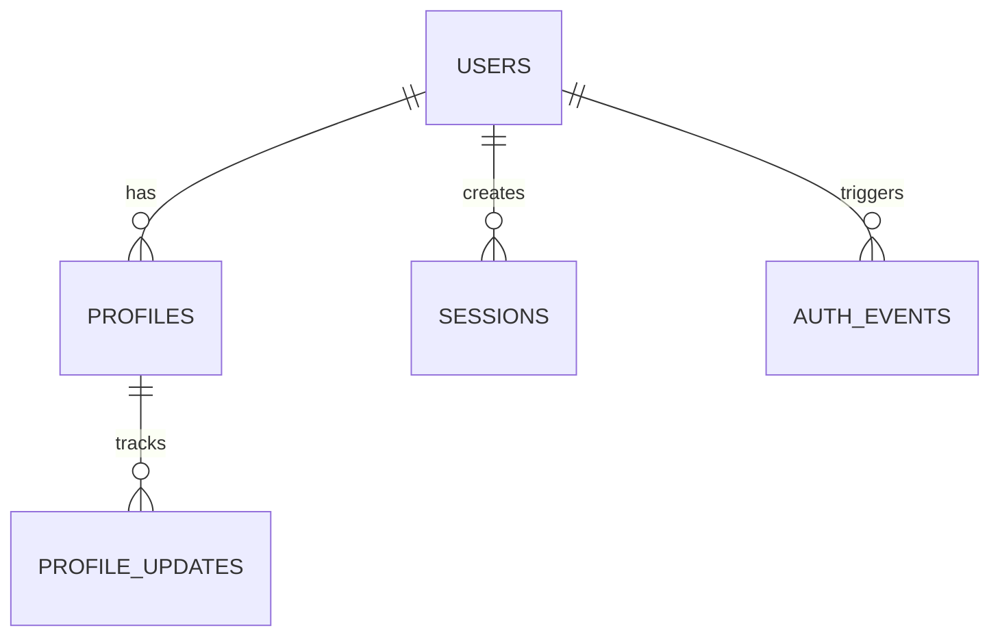
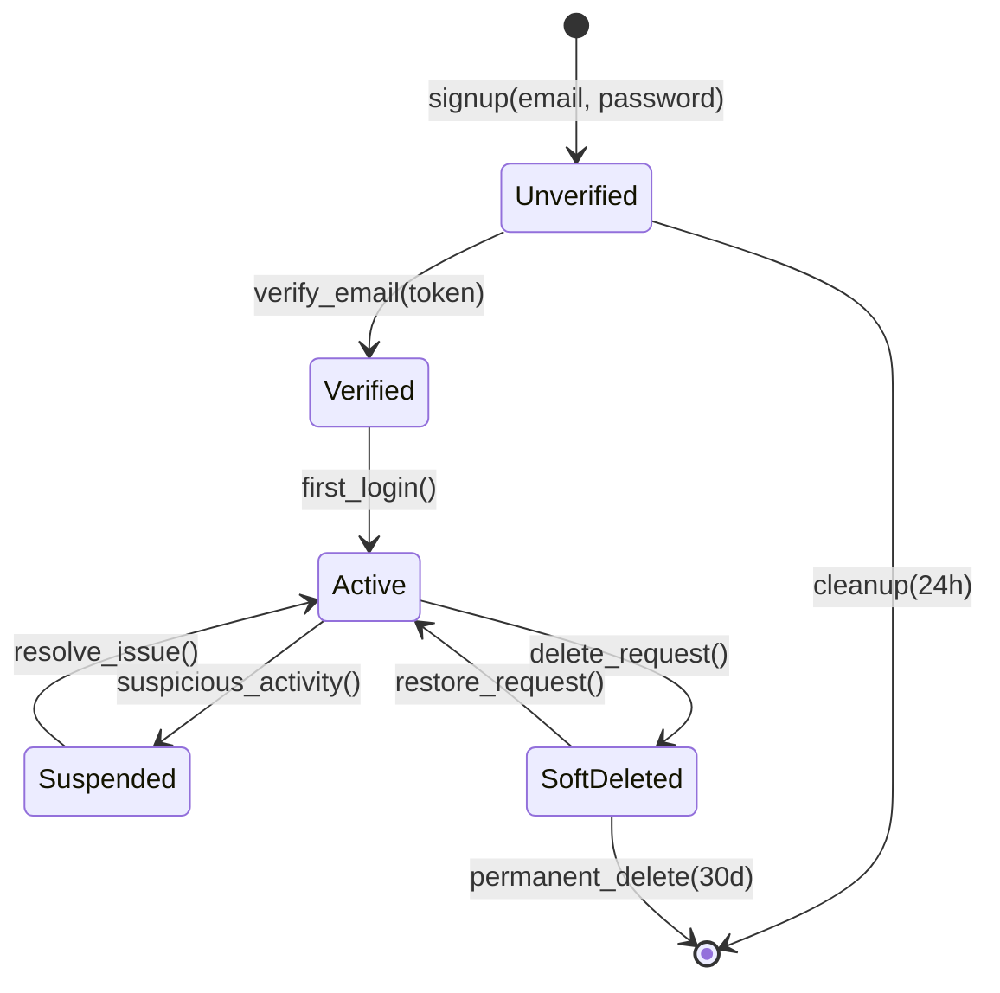
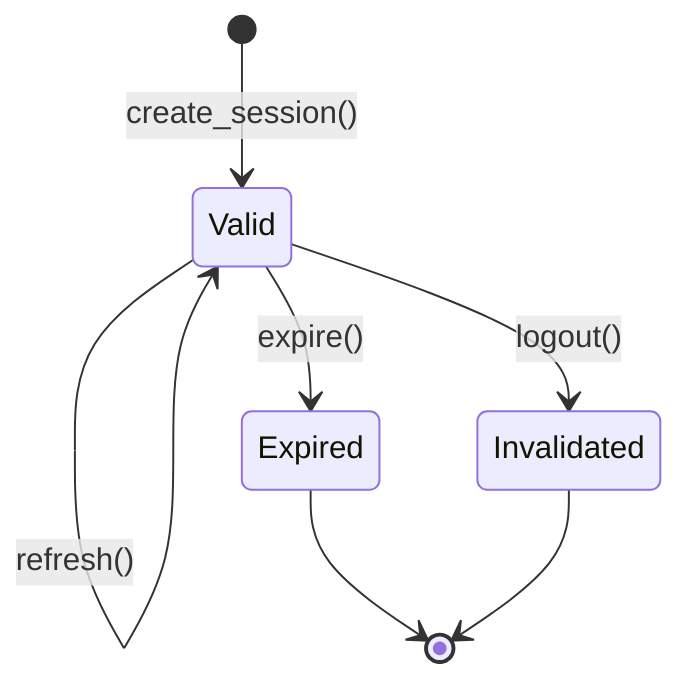

# Data Model: Personalized Auth System

**Created**: 2025-12-18
**Database**: Neon PostgreSQL (shared with Better-Auth)

## Entity Relationship Diagram



## Core Entities

### User (Better-Auth Managed)

**Table**: `users`

| Column | Type | Constraints | Description |
|--------|------|-------------|-------------|
| id | UUID | PRIMARY KEY | Better-Auth generated UUID |
| email | VARCHAR(255) | UNIQUE NOT NULL | User email address |
| password_hash | VARCHAR(255) | NOT NULL | Bcrypt hashed password |
| email_verified | BOOLEAN | NOT NULL DEFAULT FALSE | Email verification status |
| created_at | TIMESTAMP | NOT NULL DEFAULT NOW() | Account creation timestamp |
| updated_at | TIMESTAMP | NOT NULL DEFAULT NOW() | Last update timestamp |
| deleted_at | TIMESTAMP | NULL | Soft-delete timestamp |

**Relationships**:
- One-to-one with Profile
- One-to-many with Sessions
- One-to-many with AuthEvents

**Validation Rules**:
- Email: RFC 5322 format
- Password: Minimum 8 chars, 1 uppercase, 1 lowercase, 1 number, 1 special

### Profile (Custom)

**Table**: `profiles`

| Column | Type | Constraints | Description |
|--------|------|-------------|-------------|
| user_id | UUID | PRIMARY KEY, FK users.id | Reference to user |
| software_years | INTEGER | CHECK >= 0 | Years of software experience |
| software_languages | TEXT[] | NOT NULL DEFAULT '{}' | Array of programming languages |
| software_frameworks | TEXT[] | NOT NULL DEFAULT '{}' | Array of frameworks |
| hardware_robotics | BOOLEAN | NOT NULL DEFAULT FALSE | Robotics experience |
| hardware_embedded | BOOLEAN | NOT NULL DEFAULT FALSE | Embedded systems experience |
| hardware_iot | BOOLEAN | NOT NULL DEFAULT FALSE | IoT experience |
| experience_level | VARCHAR(20) | CHECK IN ('beginner', 'intermediate', 'advanced', 'expert') | Overall experience |
| interests | TEXT[] | NOT NULL DEFAULT '{}' | Technical interests |
| created_at | TIMESTAMP | NOT NULL DEFAULT NOW() | Profile creation |
| updated_at | TIMESTAMP | NOT NULL DEFAULT NOW() | Last update |

**Relationships**:
- Belongs to User (one-to-one)
- Has many ProfileUpdates (audit trail)

**Validation Rules**:
- software_years: 0-50
- experience_level: Determined by questionnaire logic
- interests: Maximum 10 items

### Session (Better-Auth Managed)

**Table**: `sessions`

| Column | Type | Constraints | Description |
|--------|------|-------------|-------------|
| id | UUID | PRIMARY KEY | Session identifier |
| user_id | UUID | NOT NULL, FK users.id | Session owner |
| token | VARCHAR(255) | UNIQUE NOT NULL | Session token |
| expires_at | TIMESTAMP | NOT NULL | Session expiration |
| created_at | TIMESTAMP | NOT NULL DEFAULT NOW() | Session creation |
| last_accessed | TIMESTAMP | NOT NULL DEFAULT NOW() | Last activity |
| ip_address | INET | NULL | Client IP |
| user_agent | TEXT | NULL | Client user agent |

**Indexing**:
- UNIQUE INDEX on token
- INDEX on user_id
- INDEX on expires_at (for cleanup)

### Auth Event (Audit Trail)

**Table**: `auth_events`

| Column | Type | Constraints | Description |
|--------|------|-------------|-------------|
| id | UUID | PRIMARY KEY | Event identifier |
| user_id | UUID | FK users.id | Related user |
| event_type | VARCHAR(50) | NOT NULL | Event type |
| event_data | JSONB | NULL | Event metadata |
| ip_address | INET | NULL | Source IP |
| user_agent | TEXT | NULL | Client info |
| timestamp | TIMESTAMP | NOT NULL DEFAULT NOW() | Event time |

**Event Types**:
- user.created
- user.verified
- auth.login
- auth.logout
- password.reset.requested
- password.reset.completed
- account.deleted

## State Transitions

### User Account Lifecycle



### Session Management



## Data Access Patterns

### Profile Creation Flow

1. User signs up via Better-Auth
2. Better-Auth creates user record
3. Webhook notifies FastAPI of new user
4. FastAPI creates empty profile record
5. User completes questionnaire
6. Profile updated with technical background

### Session Validation Flow

1. Client presents session token
2. FastAPI validates token in database
3. Check expiration and user status
4. Update last_accessed timestamp
5. Return user profile if valid

### Personalization Data Retrieval

```sql
-- Optimized query for personalization
SELECT
  u.email,
  u.email_verified,
  p.software_years,
  p.software_languages,
  p.software_frameworks,
  p.hardware_robotics,
  p.hardware_embedded,
  p.hardware_iot,
  p.experience_level,
  p.interests
FROM users u
JOIN profiles p ON u.id = p.user_id
WHERE u.id = $1
AND u.deleted_at IS NULL
AND u.email_verified = TRUE;
```

## Performance Considerations

### Indexes

```sql
-- User table indexes
CREATE INDEX idx_users_email_verified ON users(email_verified);
CREATE INDEX idx_users_deleted_at ON users(deleted_at);

-- Profile table indexes
CREATE INDEX idx_profiles_experience_level ON profiles(experience_level);
CREATE INDEX idx_profiles_languages ON profiles USING GIN(software_languages);
CREATE INDEX idx_profiles_interests ON profiles USING GIN(interests);

-- Session cleanup
CREATE INDEX idx_sessions_expires_at ON sessions(expires_at);
```

### Partitioning Strategy

- `auth_events`: Monthly partitioning by timestamp
- `sessions`: Weekly partitioning by created_at (for active cleanup)

### Caching Layer

- Redis cache for frequently accessed profiles
- Session tokens cached with 5-minute TTL
- Invalidate on profile updates

## Security Considerations

### Data Encryption

- Passwords: Bcrypt with cost factor 12
- Emails: Encrypted at rest (PII)
- Session tokens: Random 32-byte strings

### Audit Trail

- All auth events logged with immutable records
- Include IP address and user agent
- Cannot be deleted (append-only)

### Rate Limiting

- Login attempts: 5 per minute per IP
- Password reset: 3 per hour per email
- Account creation: 3 per hour per IP

### GDPR Compliance

- Right to export: Profile data in JSON format
- Right to delete: Soft-delete with 30-day recovery
- Data portability: Standardized export format